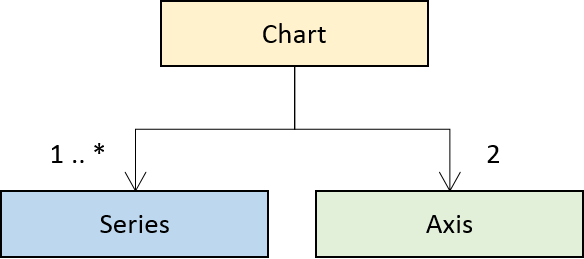
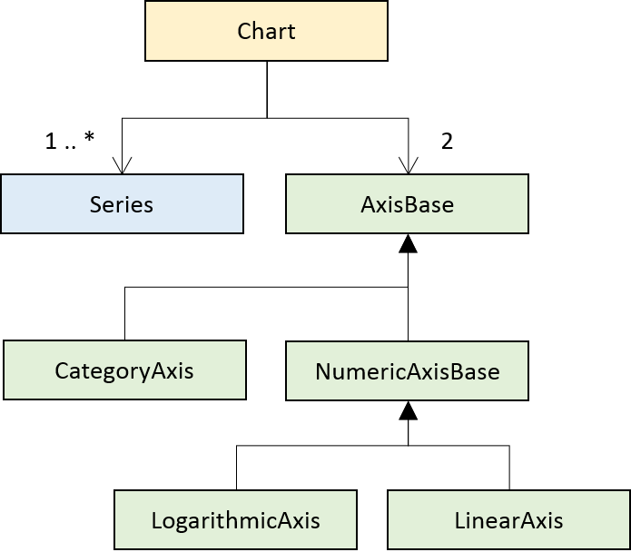
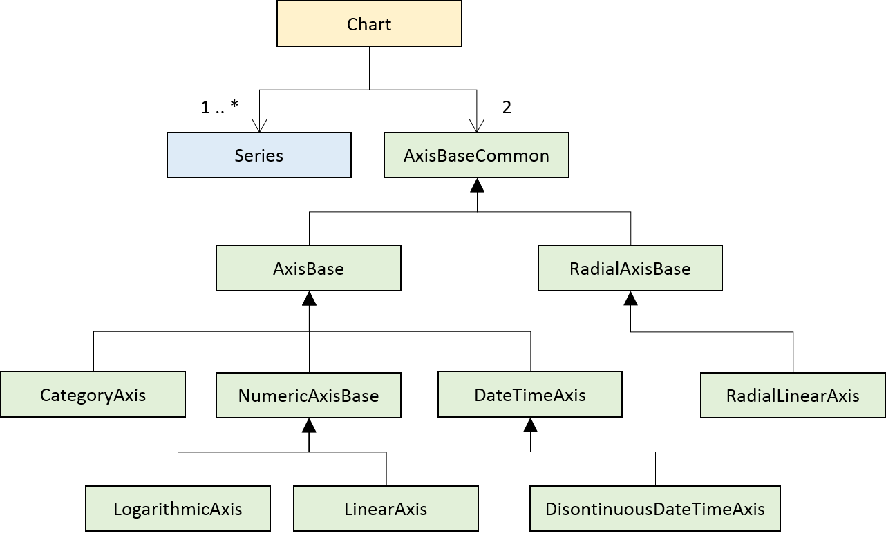
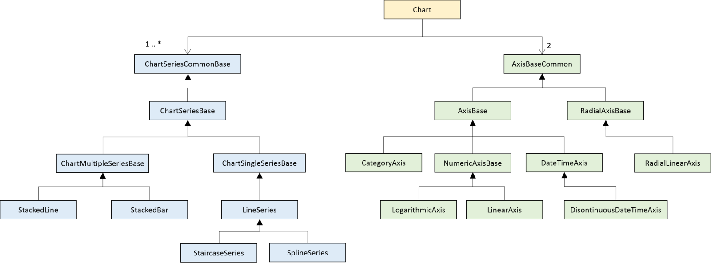
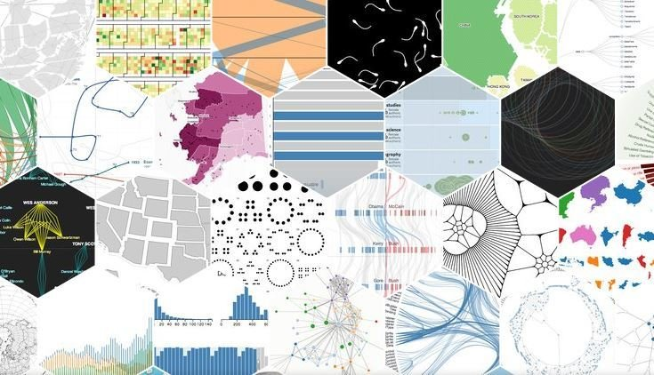
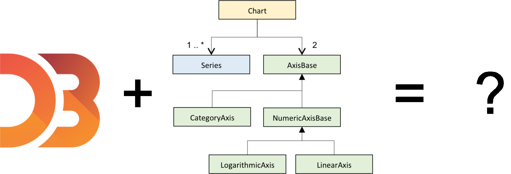
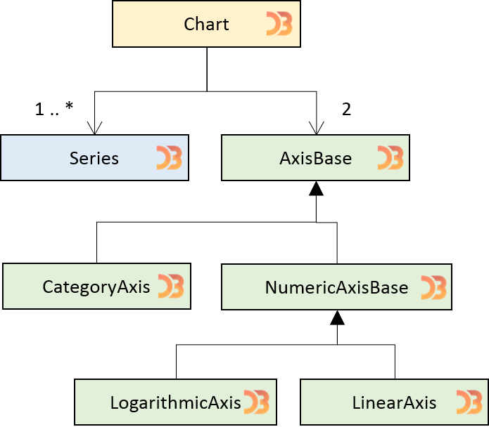

layout: true
class: center

---

# From monoliths to components with D3

Colin Eberhardt / [@ColinEberhardt](https://twitter.com/colineberhardt)<br/>
Chris Price / [@100pxls](https://twitter.com/100pxls)<br/>
Scott Logic Ltd.

London d3.js, Sept 2015

---

class: image


---

# Designing a chart

---

class: image



---

class: image



---

class: image



---

class: image



---

#Charts are monoliths

+ Complex and expansive APIs
+ 100s of classes, 1000s of methods
+ Extensibility limited by 'imagination' of the API designer

---

class: image



---

class: middle

```javascript
var data = [1, 5, 10, 6];

var bar = d3.select('#bar')
  .selectAll("div")
  .data(data);

bar.enter()
  .append("div")
  .style("width", function(d) { return (d * 20) + "px"; })
  .style("height", "50px");
```

<div id="bar" class="chart"></div>

---
class: middle

```javascript
var data = [1, 5, 10, 6];

function renderChart() {
  var bar = d3.select('#bar-live')
    .selectAll("div")
    .data(data);

  bar.enter()
    .append("div")
    .style("height", "30px");

  bar.style("width", function(d) { return (d * 20) + "px"; });

  bar.exit()
    .remove();
}
```

<div id="bar-live" class="chart"></div>

---

class: image



---

class: image



---

#Charting components

+ Charting micro-components
+ No complex object model
+ Use D3 patterns, datajoin, components, composition, ...

---
.left-column[
  ###D3 Components

  - Simple functions
]
.right-column[
```javascript
function helloWorld(selection) {
  selection.text('Hello world');
}
```

```javascript
var selection = d3.select('p');
helloWorld(selection);
```

```html
<p>Hello world</p>
```
]

---

.left-column[
  ###D3 Components

  - Simple functions
  - Call
]
.right-column[
```javascript
function helloWorld(selection) {
  selection.text('Hello world');
}
```

```javascript
d3.select('p')
  .call(helloWorld);
```

```html
<p>Hello world</p>
```
]

---
.left-column[
  ###D3 Components

  - Simple functions
  - Call
  - Created via factories
]
.right-column[
```javascript
function helloWorldFactory() {

  var helloWorld = function(selection) {
    selection.text('Hello world');
  }

  return helloWorld;
}
```

```javascript
var helloWorld = helloWorldFactory();

d3.select('p')
  .call(helloWorld);
```

```html
<p>Hello world</p>
```
]

---
.left-column[
  ###D3 Components

  - Simple functions
  - Call
  - Created via factories
  - Configurable
]
.right-column[
```javascript
function helloWorldFactory() {

  var greeting = 'Hello world';

  var helloWorld = function(selection) {
    selection.text(greeting);
  }

  helloWorld.greeting = function(x) {
    if (!arguments.length) { return greeting; }
    greeting = x;
    return helloWorld;
  };

  return helloWorld;
}
```

```javascript
var helloWorld = helloWorldFactory()
  .greeting('Goodbye cruel world');

d3.select('p')
  .call(helloWorld);
```

```html
<p>Goodbye cruel world</p>
```
]

---
.left-column[
  ###D3 Components

  - Simple functions
  - Call
  - Created via factories
  - Configurable
]
.right-column[
```javascript
function helloWorldFactory() {

  var greeting = 'Hello world';

  var helloWorld = function(selection) {
    selection.text(greeting);
  }

  helloWorld.greeting = function(x) {
    if (!arguments.length) { return greeting; }
    greeting = x;
    return helloWorld;
  };

  return helloWorld;
}
```

```javascript
var helloWorld = helloWorldFactory()
  .greeting('Goodbye cruel world');

d3.select('p')
  .call(helloWorld);
```

```html
<p>Goodbye cruel world</p>
```
]

---

#Components

+ A simple, configurable, unit of re-use
+ Operate on selections
+ They are not object-oriented!
+ Should be idempotent

---

 > Idempotence is the property of certain operations in mathematics and computer science, that can be applied multiple times without changing the result beyond the initial application.

---

.left-column[
  ###d3fc Components

  - Use datajoin (Note use of `datum`)
]
.right-column[
```javascript
function paragraphFactory() {

  var paragraph = function(selection) {

    selection.each(function(data) {

      var container = d3.select(this);

      container.selectAll('p')
        .data(data)
        .enter()
        .append('p')
        .text(function(d) { return d; });

    });
  }

  return paragraph;
}
```

```javascript
var helloWorld = paragraphFactory();

d3.select('.prose')
  .datum(['Hello world', 'Goodbye cruel world'])
  .call(helloWorld);
```

```html
<div class='.prose'>
  <p>Hello world</p>
  <p>Goodbye cruel world</p>
</div>
```
]

---

.left-column[
  ###d3fc Components

  - Use datajoin (Note use of `datum`)
]
.right-column[
```javascript
function paragraphFactory() {

  var paragraph = function(selection) {

    selection.each(function(data) {...});
  }

  return paragraph;
}
```

```javascript
d3.select('.prose')
  .selectAll('div')
  .data([
    ['Hello world', 'Goodbye cruel world'],
    ['Feeling good today']
  ])
  .enter()
  .append('div')
  .call(helloWorld);
```

```html
<div class="prose">
  <div>
    <p>Hello world</p>
    <p>Goodbye cruel world</p>
  </div>
  <div>
    <p>Feeling good today</p>
  </div>
</div>
```
]

---

.left-column[
  ###d3fc Components

  - Use datajoin (Note use of `datum`)
  - pay attention to enter / update / exit
]
.right-column[
```javascript
function paragraphFactory() {

  var paragraph = function(selection) {

    selection.each(function(data) {

      var container = d3.select(this);

      container.selectAll('p')
        .data(data)
        .enter()
        .append('p')
        .text(function(d) { return d; });

    });
  }

  return paragraph;
}
```
]

---

.left-column[
  ###d3fc Components

  - Use datajoin (Note use of `datum`)
  - pay attention to enter / update / exit
]
.right-column[
```javascript
function paragraphFactory() {

  var paragraph = function(selection) {

    selection.each(function(data) {

      var container = d3.select(this)

      var para = container.selectAll('p')
        .data(data);

      para.enter()
        .append('p');

      para.text(function(d) { return d; });

      para.exit()
        .remove();
    });
  }

  return paragraph;
}
```
]

---

.left-column[
  ###d3fc Components

  - Use datajoin (Note use of `datum`)
  - pay attention to enter / update / exit
  - Components are stateless
]
.right-column[
```javascript
???
```
]

---

.left-column[
  ###d3fc Components

  - Use datajoin (Note use of `datum`)
  - pay attention to enter / update / exit
  - Components are stateless
  - Compose and rebind
]
.right-column[
```javascript
function stripeFactory() {

  var odd = 'odd', even = 'even';

  var stripe = function(selection) {

    selection.each(function(data, index) {

      d3.select(this)
        .attr('class', index % 2 === 0 ? odd : even);

    });

  };

  stripe.odd = function(x) { ... };

  stripe.even = function(x) { ... };

  return stripe;
}
```
]

---

.left-column[
  ###d3fc Components

  - Use datajoin (Note use of `datum`)
  - pay attention to enter / update / exit
  - Components are stateless
  - Compose and rebind
]
.right-column[
```javascript
function paragraphFactory() {

  var stripe = stripeFactory();

  var paragraph = function(selection) {

    selection.each(function(data) {

      var container = d3.select(this)

      var para = container.selectAll('p')
        .data(data);

      para.enter()
        .append('p')
        .call(stripe);

      para.text(function(d) { return d; });

      para.exit()
        .remove();
    });
  }

  d3.rebind(paragraph, stripe, 'odd', 'even');

  return paragraph;
}
```
]

---

.left-column[
  ###d3fc Components

  - Use datajoin (Note use of `datum`)
  - pay attention to enter / update / exit
  - Components are stateless
  - Compose and rebind
]
.right-column[
```javascript
var para = paragraphFactory()
  .odd('strange')
  .even('funny');

d3.select('.prose')
  .datum(['Computer Haiku',
    'How would you write a program',
    'To make them for you'])
  .call(para);
```

```html
<div class="prose">
  <p class="strange">Computer Haiku</p>
  <p class="funny">How would you write a program</p>
  <p class="strange">To make them for you</p>
</div>
```
]

---

.left-column[
  ###d3fc Components

  - Use datajoin (Note use of `datum`)
  - pay attention to enter / update / exit
  - Components are stateless
  - Compose and rebind
  - Singleton elements
]
.right-column[
```javascript
function copyrightGenerator() {

  var copyright = function(selection) {

    selection.each(function(data) {

      var container = d3.select(this);

      container.selectAll('span')
        .data([data])
        .enter()
        .append('span')
        .text('(©) Copyright Colin Eberhardt 2010');

    });

  }

  return copyright;
}
```
]

---

class: center

#But what about the datajoin?

---

.left-column[
  ###Decorate pattern

  - How do we expose the datajoin?
]
.right-column[
```javascript
function paragraphFactory() {

  var paragraph = function(selection) {

    selection.each(function(data) {

      var container = d3.select(this)

      var para = container.selectAll('p')
        .data(data);

      para.enter()
        .append('p');

      para.text(function(d) { return d; });

      para.exit()
        .remove();
    });
  }

  return paragraph;
}
```
]

---

.left-column[
  ###Decorate pattern

  - How do we expose the datajoin?
  - `dataJoin` component takes care of enter / update / exit
]
.right-column[
```javascript
function paragraphFactory() {

  var decorate = fc.util.fn.noop;

  var dataJoin = fc.util.dataJoin()
        .selector('p.para')
        .element('p')
        .attr('class', 'para');

  var paragraph = function(selection) {

    selection.each(function(data, index) {

      var p = dataJoin(this, data);
      p.text(function(d) { return d; });
      decorate(p, data, index);

    });
  }

  paragraph.decorate = function(x) { ... };

  return paragraph;
}
```
]

---

.left-column[
  ###Decorate pattern

  - How do we expose the datajoin?
  - `dataJoin` component takes care of enter / update / exit
]
.right-column[
```javascript
var para = paragraphFactory()
  .decorate(function(sel) {
    sel.enter()
      .attr('class', function(d, i) {
        return i === 0 ? 'highlight' : '';
      });
  })

d3.select('.prose')
  .datum(['Computer Haiku',
    'How would you write a program',
    'To make them for you'])
  .call(para);
```

```html
<div class="prose">
  <p class="highlight">Computer Haiku</p>
  <p class="">How would you write a program</p>
  <p class="">To make them for you</p>
</div>
```
]

---

#Time for some charts!
(point series decoration)

---

```javascript
function renderChart() {
    var colour = d3.scale.linear()
        .domain([-20, 20])
        .range(['blue', 'red']);

    var chart = fc.chart.cartesianChart(
            d3.scale.ordinal(), d3.scale.linear())
        .xBaseline(0)
        .transitionDuration(2000)
        .xDomain(data.map(function(d) { return d.name; }))
        .yDomain(clampRange(fc.util.extent(data, 'age')));

    var bar = fc.series.bar()
        .yValue(function(d) { return d.age; })
        .xValue(function(d) { return d.name; })
        .key(function(d) { return d.name; })
        .decorate(function(sel) {
            sel.select('path')
                .style('fill', function(d, i) { return colour(d.age); });
        });

    chart.plotArea(bar);

    d3.select('#bar-transitions')
        .datum(data)
        .call(chart);
}
```

---

<div id='bar-transitions' style="width: 700px; height: 400px; margin-left:auto; margin-right:auto"></div>

---

#Yahoo example

(see: http://d3fc.io/examples/yahoo-finance-chart/)

---

# From monoliths to components with D3

# d3fc.io

